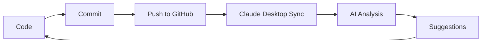

# 🚀 Claude Desktop Test Project

[](https://claude.ai/desktop)
[](https://github.com/github/github-mcp-server)
[](https://nodejs.org/)

## 🎯 **Project Overview**

This repository demonstrates the powerful integration between **Claude Desktop** and **GitHub** through the Model Context Protocol (MCP). It showcases how AI can enhance your development workflow with real-time repository management.

## ✨ **Features**

### 🤖 **AI-Powered Development**
- **Real-time code analysis** and suggestions
- **Automated documentation** generation
- **Intelligent bug detection** and fixes
- **Performance optimization** recommendations

### 🔧 **GitHub Integration**
- **Direct repository management** from Claude Desktop
- **File creation and editing** through AI commands
- **Issue and PR management** with natural language
- **Branch operations** and version control

### 📊 **Development Tools**
- **Express.js** backend server
- **Modern frontend** with responsive design
- **Jest testing** framework
- **Docker** containerization support

## 🛠️ **Quick Start**

### **Prerequisites**
- Node.js 18+ installed
- Claude Desktop app
- GitHub Personal Access Token

### **Installation**
```bash
# Clone the repository
git clone https://github.com/ismailislerr/claude-desktop-test.git
cd claude-desktop-test

# Install dependencies
npm install

# Start development server
npm run dev
```

### **API Endpoints**
- `GET /` - Welcome message and project info
- `GET /api/status` - Server status and uptime
- `GET /api/claude` - Claude integration capabilities

## 🎨 **Demo**

Open `index.html` in your browser for an interactive demo showcasing:
- **Glassmorphism UI** with modern animations
- **API testing** with real-time results
- **Responsive design** for all devices

## 🤝 **Claude Desktop Integration**

This project is specifically designed to work with Claude Desktop's GitHub MCP server:

1. **Repository Management**: Create, read, update files
2. **Issue Tracking**: Automated issue creation and management
3. **Code Review**: AI-powered code analysis and suggestions
4. **Documentation**: Auto-generated docs and README updates

## 📈 **Development Workflow**



## 🚀 **Next Steps**

- [ ] Add more AI integration examples
- [ ] Implement real-time collaboration features
- [ ] Add database integration (PostgreSQL/SQLite)
- [ ] Create Docker containerization
- [ ] Set up CI/CD pipeline with GitHub Actions

## 📄 **License**

This project is licensed under the MIT License - see the [LICENSE](LICENSE) file for details.

## 🔗 **Links**

- **GitHub Repository**: https://github.com/ismailislerr/claude-desktop-test
- **Claude Desktop**: [Download](https://claude.ai/desktop)
- **GitHub MCP Server**: [Documentation](https://github.com/github/github-mcp-server)

---

**🎉 Built with Claude Desktop + GitHub MCP Integration**
*Demonstrating the future of AI-powered development*